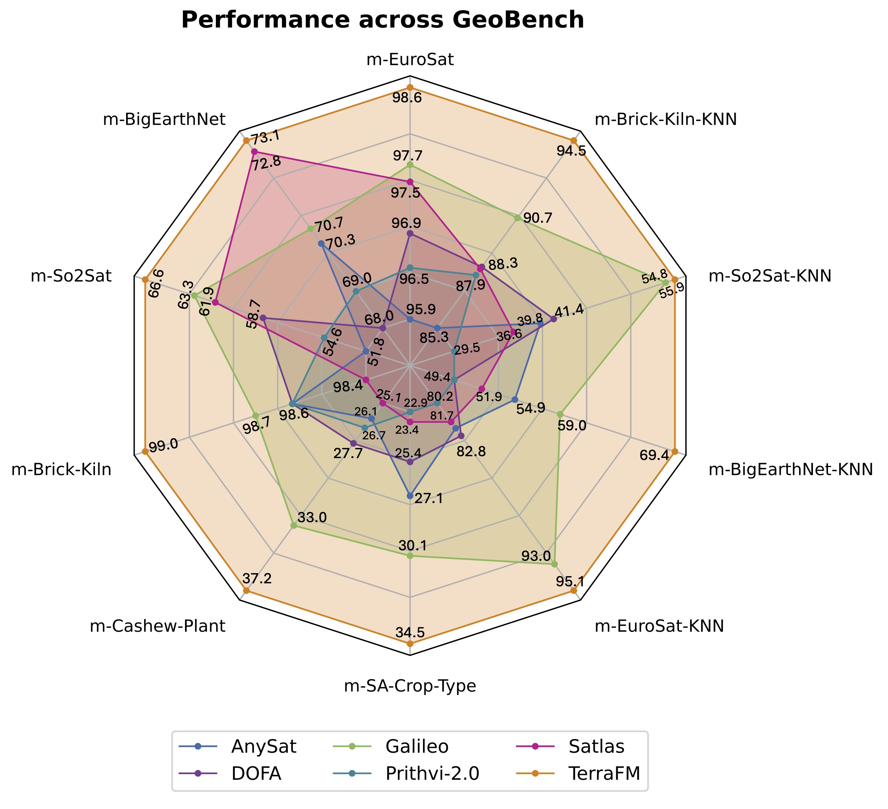
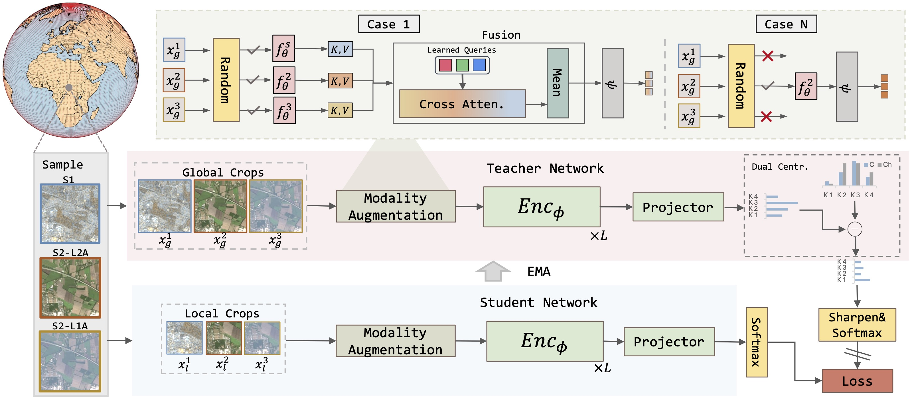
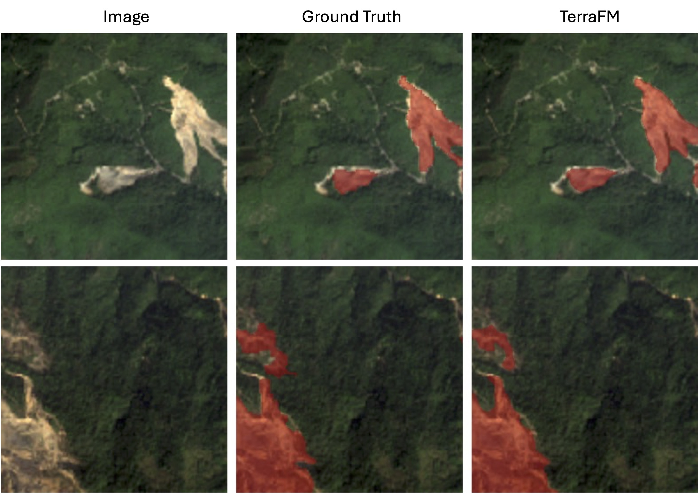

# TerraFM: A Scalable Foundation Model for Unified Multisensor Earth Observation
<p align="center">
    
</p>

#### [Muhammad Sohail Danish](https://www.linkedin.com/in/muhammad-sohail-danish/), [Muhammad Akhtar Munir](https://akhtarvision.github.io/), [Syed Roshaan Ali Shah](https://www.linkedin.com/in/syed-roshaan-ali-shah-b797b44a/), [Muhammad Haris Khan](https://m-haris-khan.com/), [Rao Muhammad Anwer](https://mbzuai.ac.ae/study/faculty/rao-muhammad-anwer/) , [Jorma Laaksonen](https://www.aalto.fi/en/people/jorma-laaksonen), [Fahad Shahbaz Khan](https://sites.google.com/view/fahadkhans/home), and [Salman Khan](https://salman-h-khan.github.io/)


#### **Mohamed bin Zayed University of AI, University College London, Aalto University, Linköping University, Australian National University**

[](https://arxiv.org/abs/2506.06281)
[](#-model-zoo)

---

## 📢 Latest Updates
- **Jun-09-25**: 🚀 Initial release of **TerraFM codebase** and **pretrained models**
- **Jun-09-25**: 📄 Paper released on arXiv: [arxiv link](https://arxiv.org/abs/2506.06281). 🔥🔥

---

## 🌍 Overview

**TerraFM** is a scalable foundation model designed for unified processing of multisensor Earth Observation (EO) data. Built on a ViT backbone and trained over **18.7M tiles (~23T pixels)** from Sentinel-1 SAR and Sentinel-2 optical imagery, TerraFM unifies modality-specific inputs using:

- 🧩 Modality-specific patch embeddings  
- 🌀 Adaptive cross-attention fusion  
- 🎯 Dual-centering regularization for long-tailed distributions

TerraFM sets a new benchmark on **GEO-Bench** and **Copernicus-Bench**, demonstrating strong generalization across geographies, modalities, and tasks — including classification, segmentation, and landslide detection.

---


## 🔬 Key Features

<p align="center">
  
</p>

- **Multimodal Pretraining**: Uses Sentinel-1 (SAR) and Sentinel-2 (L1C, L2A) as natural augmentations.
- **Large-Scale Dataset**: Trained on 18.7M global tiles from the [Major-TOM](https://huggingface.co/Major-TOM) dataset.
- **Cross-Attention Fusion**: Dynamically aggregates information across sensors at patch level.
- **Dual-Centering**: Mitigates long-tailed land cover bias using ESA WorldCover statistics.
- **Benchmark SOTA**: Outperforms prior FMs (Galileo, Prithvi, DOFA) across multiple EO tasks.

---
## 🧱 Architecture

<p align="center">
  
</p>

Overall architecture of TerraFM. It unifies student-teacher contrastive framework with modality augmentation with cross-attention fusion, and a new dual centering regularization. TerraFM is founded on ViT backbone and is trained on 18.7M globally distributed samples for pre-training and utilizes large-tile inputs for encoding broader spatial context. For illustration, RGB channels from S2-L2A and S2-L1C are selected, and S1 is visualized using a false-color RGB composite.

---
## 🧠 Model Zoo

| Model | Modality | Input Size | Backbone | Link |
|-------|----------|------------|--------|------|
| TerraFM-B | Sentinel-1 RTC + Sentinel-2 Level 2A + Sentinel-2 Level 1C | 224×224 | ViT-Base | [Download](https://huggingface.co/MBZUAI/TerraFM) |
| TerraFM-L | Sentinel-1 RTC + Sentinel-2 Level 2A + Sentinel-2 Level 1C | 224×224 | ViT-Large | [Download](https://huggingface.co/MBZUAI/TerraFM) |

---

## 🛠 Usage

TerraFM can be used directly via the `terrafm.py` module, which provides standalone implementations of the TerraFM-Base and TerraFM-Large models for easy integration into any codebase.

```python
from terrafm import terrafm_base, terrafm_large
import torch

# Simulated input: 1 sample, 12 channels, 224×224 resolution (e.g., Sentinel-2 L2A)
x = torch.randn(1, 12, 224, 224)

# Load TerraFM-Base model
model = terrafm_base()

# Load pretrained weights (e.g., TerraFM-B.pth)
state_dict = torch.load("TerraFM-B.pth", map_location="cpu")
msg = model.load_state_dict(state_dict, strict=False)

# Forward pass
y = model(x)
print(f"Output shape: {y.shape}")
```
---


## 📊 Results

### 🔍 k-NN Classification Results

We evaluate image classification using k-nearest neighbors (kNN) and report Top-1 accuracy for all single-label tasks. For the multilabel BigEarthNet benchmark, we report the F1 score.

| Model           | Backbone   | m-EuroSat (100%) | m-EuroSat (1%) | m-BigEarthNet (100%) | m-BigEarthNet (1%) | m-So2Sat (100%) | m-So2Sat (1%) | m-Brick-Kiln (100%) | m-Brick-Kiln (1%) |
|----------------|------------|------------------|----------------|------------------------|--------------------|------------------|----------------|----------------------|--------------------|
| SatMAE         | ViT-Base   | 84.1             | 34.8           | 50.6                   | 29.0               | 36.0             | 23.1           | 86.1                 | 73.5               |
| SatMAE++       | ViT-Large  | 82.7             | 48.5           | 50.8                   | 31.6               | 34.7             | 23.4           | 89.6                 | 76.7               |
| CROMA          | ViT-Base   | 85.6             | 51.3           | 58.8                   | 44.7               | 48.8             | 33.8           | 92.6                 | 85.1               |
| SoftCon        | ViT-Small  | 89.8             | 27.2           | 64.7                   | 43.3               | 51.1             | 31.4           | 89.2                 | 77.8               |
| DOFA           | ViT-Base   | 82.8             | 49.6           | 49.4                   | 29.9               | 41.4             | 29.4           | 88.3                 | 78.3               |
| Satlas         | Swin-Tiny  | 81.7             | 35.8           | 51.9                   | 29.6               | 36.6             | 27.1           | 88.2                 | 73.0               |
| MMEarth        | CNN-atto   | 81.7             | 30.0           | 58.3                   | 39.6               | 39.8             | 25.1           | 89.4                 | 79.7               |
| DeCUR          | ViT-Small  | 89.0             | 46.6           | 63.8                   | 49.6               | 45.8             | 30.9           | 83.7                 | 74.2               |
| AnySat         | ViT-Base   | 82.2             | 47.1           | 54.9                   | 33.7               | 39.8             | 29.0           | 85.3                 | 72.0               |
| Galileo        | ViT-Base   | 93.0             | 56.6           | 59.0                   | 36.5               | 54.8             | **43.2**       | 90.7                 | 78.0               |
| Prithvi-2.0    | ViT-Large  | 80.2             | 48.0           | 49.4                   | 28.8               | 29.5             | 26.1           | 87.9                 | 80.6               |
| Copernicus-FM  | ViT-Base   | 76.0             | 47.4           | 53.8                   | 33.3               | 38.4             | 23.3           | 93.0                 | 83.2               |
| **TerraFM**    | ViT-Base   | _94.2_           | _59.3_         | _68.7_                 | 49.4               | _55.1_           | _41.6_         | **94.5**             | **85.6**           |
|**TerraFM**| ViT-Large  | **95.1**         | **62.1**       | **69.4**               | **50.6**           | **55.9**         | 41.1           | _93.0_               | 82.2               |


### 🛰 Copernicus-Bench

Comparison of TerraFM with existing supervised and self-supervised methods on **Copernicus-Bench**.  
Metrics include **OA** (Overall Accuracy), **mAP** (mean Average Precision), and **mIoU** (mean Intersection over Union).

| Dataset         | Metric | Supervised | Random | SoftCon | CROMA | DOFA | Copernicus-FM | **TerraFM** |
|----------------|--------|------------|--------|---------|--------|------|----------------|-------------|
| **Backbone**    | --     | ViT-B/16   | ViT-B/16 | ViT-B/14 | ViT-B/8 | ViT-B/16 | ViT-B/16      | ViT-B/16    |
| **Cloud-S2**       | mIoU  | 59.4       | 60.4   | 66.9    | 65.0   | 65.0 | 66.7          | **67.9**    |
| **EuroSAT-S1**     | OA    | 81.5       | 75.4   | 83.6    | 83.9   | 81.7 | 87.2          | **87.8**    |
| **EuroSAT-S2**     | OA    | 97.6       | 92.5   | 96.7    | 97.0   | 97.2 | 97.9          | **99.1**    |
| **BigEarthNet-S1** | mAP   | 70.6       | 63.8   | **78.7**| 70.8   | 70.5 | 77.9          | 76.9        |
| **BigEarthNet-S2** | mAP   | 80.1       | 71.6   | 83.6    | 76.4   | 75.5 | 79.0          | **84.4**    |
| **DFC2020-S1**     | mIoU  | 50.8       | 45.4   | 52.8    | 52.7   | 49.7 | 52.4          | **55.4**    |
| **DFC2020-S2**     | mIoU  | 66.2       | 62.3   | 64.1    | **66.5**| 61.8 | 64.5          | 63.8        |
| **LCZ-S2**         | OA    | 85.3       | 77.4   | 83.6    | 84.1   | 83.0 | 84.4          | **87.0**    |

### 🧪 GEO-Bench Performance

Performance comparison on GEO-Bench for both **classification** (Top-1 Accuracy), **segmentation** (mIoU), and **F1 score** (for m-BigEarthNet).  
TerraFM achieves state-of-the-art results across multiple datasets, outperforming previous foundation models.

| Method       | Backbone   | m-EuroSat | m-BigEarthNet | m-So2Sat | m-Brick-Kiln | m-Cashew-Plant | m-SA-Crop-Type |
|--------------|------------|-----------|----------------|----------|----------------|------------------|------------------|
| SatMAE       | ViT-Large  | 96.6      | 68.3           | 57.2     | 98.4           | 30.8             | 24.8             |
| SatMAE++     | ViT-Large  | 96.5      | 67.9           | 56.0     | 98.6           | 29.6             | 25.7             |
| CROMA        | ViT-Large  | 96.6      | 71.9           | 60.6     | 98.7           | 31.8             | 32.0             |
| SoftCon      | ViT-Base   | 97.5      | 70.3           | 61.7     | 98.7           | 29.6             | 30.8             |
| DOFA         | ViT-Large  | 96.9      | 68.0           | 58.7     | 98.6           | 27.7             | 25.4             |
| Satlas       | Swin-Base  | 97.5      | 72.8           | 61.9     | **98.9**       | 25.1             | 23.4             |
| MMEarth      | CNN-atto   | 95.7      | 70.0           | 57.2     | 98.9           | 24.2             | 22.2             |
| DeCUR        | ViT-Small  | 97.9      | 70.9           | 61.7     | 98.7           | 26.2             | 21.5             |
| Prithvi 2.0  | ViT-Large  | 96.5      | 69.0           | 54.6     | 98.6           | 26.7             | 22.9             |
| AnySat       | ViT-Base   | 95.9      | 70.3           | 51.8     | 98.6           | 26.1             | 27.1             |
| Galileo      | ViT-Base   | 97.7      | 70.7           | 63.3     | 98.7           | 33.0             | 30.1             |
| **TerraFM**  | ViT-Base   | *98.1*    | 72.6           | *64.9*   | 98.7           | *34.1*           | *33.0*           |
| **TerraFM**  | ViT-Large  | **98.6**  | **73.1**       | **66.6** | **99.0**       | **37.2**         | **34.5**         |


### 🌋 Landslide Detection (Landslide4Sense)

Landslide detection performance on the **Landslide4Sense** test set.  
Despite having significantly fewer parameters (120M vs. 300M), **TerraFM** achieves higher overall segmentation performance, especially for landslide regions.
| Model                  | mIoU | IoU (Landslide) |
|------------------------|------|-----------------|
| Prithvi-EO-2.0 (300M)  | 65.0 | 31.5            |
| **TerraFM (120M)**     | **70.8** | **43.1**     |

<p align="center">
  
</p>
---

## 📜 Citation
If you find our work and this repository useful, please consider giving our repo a star and citing our paper as follows:
```bibtex
@article{danish2025terrafmscalablefoundationmodel,
      title={TerraFM: A Scalable Foundation Model for Unified Multisensor Earth Observation}, 
      author={Muhammad Sohail Danish and Muhammad Akhtar Munir and Syed Roshaan Ali Shah and Muhammad Haris Khan and Rao Muhammad Anwer and Jorma Laaksonen and Fahad Shahbaz Khan and Salman Khan},
      year={2025},
      eprint={2506.06281},
      archivePrefix={arXiv},
      primaryClass={cs.CV},
      url={https://arxiv.org/abs/2506.06281}, 
}
```


## 📨 Contact
If you have any questions, please create an issue on this repository or contact at muhammad.sohail@mbzuai.ac.ae.
